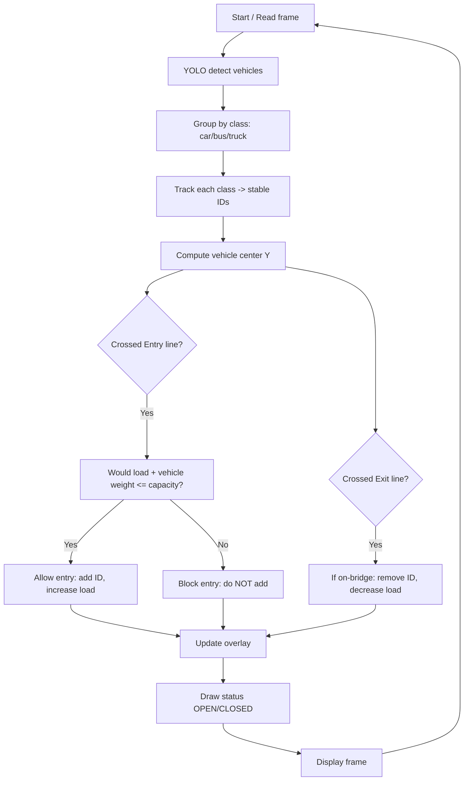

# YOLOv8 Multiple Vehicle Detection + Smart Bridge Load Control

This project detects and tracks vehicles in a video using YOLOv8 and adds an intelligent bridge control system:
- It continuously estimates the current load on a bridge.
- The bridge has a capacity limit of 20 tons.
- When admitting a new vehicle would exceed the capacity, the system blocks entry (no new vehicles can pass) until enough weight exits.

The video feed shows real-time status overlays: current load, capacity, and whether the bridge is OPEN or CLOSED.

### What’s included
- Vehicle detection (cars, buses, trucks) with YOLOv8
- Lightweight multi-object tracking to assign stable IDs per vehicle
- Entry/exit line logic to know when a vehicle enters/leaves the bridge
- Per-class weight estimates (customizable)
- Real-time bridge capacity management (default 20 tons)

---

## Quick Start (Beginner Friendly)

1) Install Python 3.9+ (recommended)

2) Create and activate a virtual environment (optional but recommended)
```bash
python3 -m venv .venv
source .venv/bin/activate
```

3) Install dependencies
```bash
pip install ultralytics opencv-python pandas cvzone
```

4) Run the app
```bash
python yolov8-multiple-vehicle-detection/mainh.py
```

You should see a window with the processed video. Press Esc to quit.

---

## How It Works (Step by Step)

1. Read a video frame.
2. Detect objects using YOLOv8.
3. Keep only vehicles of interest: car, bus, truck.
4. Track each vehicle across frames to give it a stable ID.
5. Use two horizontal lines:
   - Entry line (vehicle enters bridge when crossing this line)
   - Exit line (vehicle leaves bridge when crossing this line)
6. When a tracked vehicle crosses the entry line:
   - Check its estimated weight (based on class) and the current total on-bridge load.
   - If admitting it keeps the total load <= 20 tons, it is allowed and the load increases.
   - Otherwise, the bridge is CLOSED for new entries (the vehicle is visually blocked) until weight drops.
7. When a tracked vehicle crosses the exit line and it was on the bridge, we subtract its weight.
8. The overlay shows:
   - OPEN/CLOSED
   - Current load vs capacity (tons)
   - A red barrier strip when CLOSED

---

## Flowchart



---

## Configuration

Open `yolov8-multiple-vehicle-detection/mainh.py` and look at the top constants:

```python
CAPACITY_TONS = 20.0
VEHICLE_WEIGHTS_TONS = {
    'car': 1.5,
    'bus': 12.0,
    'truck': 15.0,
}

ENTRY_LINE_Y = 184   # Entry line position (in pixels, Y axis)
EXIT_LINE_Y  = 209   # Exit line position (in pixels, Y axis)
LINE_TOLERANCE = 8   # Crossing tolerance (pixels)
```

- **Change capacity**: set `CAPACITY_TONS` to your desired limit.
- **Adjust weights**: edit `VEHICLE_WEIGHTS_TONS` to better match your environment.
- **Move lines**: tweak `ENTRY_LINE_Y` and `EXIT_LINE_Y` to match your scene.

Tip: Use the mouse to inspect coordinates in the window if needed (debugging hook exists in code).

---

## Files You’ll Touch

- `yolov8-multiple-vehicle-detection/mainh.py`: main app with detection, tracking, and bridge logic
- `yolov8-multiple-vehicle-detection/tracker.py`: simple multi-object tracker used to keep stable IDs
- `yolov8-multiple-vehicle-detection/coco.txt`: class labels used by the YOLO model
- `yolov8-multiple-vehicle-detection/tf.mp4`: sample input video (you can replace it)
- `yolov8-multiple-vehicle-detection/yolov8s.pt`: YOLOv8 weights file (pretrained)

---

## Understanding Entry/Exit and Blocking

- A vehicle is considered “on the bridge” only after it crosses the entry line and is admitted.
- If admitting a vehicle would exceed the capacity, the system:
  - Keeps the bridge CLOSED to new entries
  - Shows a red barrier at the entry line and a message: “NO ENTRY - OVER CAPACITY”
  - Continues to allow vehicles already on the bridge to exit; once enough weight exits, the bridge reopens automatically.

This is purely a logic/visual block in this demo; it does not physically stop vehicles. In a real system, you’d connect this signal to a hardware barrier.

---

## Replace the Input Video (Optional)

- Put your own video file in `yolov8-multiple-vehicle-detection/` and update this line in `mainh.py`:
```python
cap = cv2.VideoCapture('tf.mp4')  # change to your filename
```

For live cameras, pass an index (e.g., `0`) or RTSP URL to `VideoCapture`.

---

## Requirements

- Python 3.9+
- Packages:
  - `ultralytics` (YOLOv8)
  - `opencv-python`
  - `pandas`
  - `cvzone`

Install via:
```bash
pip install ultralytics opencv-python pandas cvzone
```

If you have a compatible GPU and want acceleration, follow Ultralytics’ docs for CUDA/torch install instructions, then install `ultralytics`.

---

## Troubleshooting

- "No module named cv2" → `pip install opencv-python`
- "No module named ultralytics" → `pip install ultralytics`
- Video window not showing → some environments (like headless servers) can’t open GUI windows. Run locally or set up a virtual display.
- Model loads slow on first run → weights are large; after the first load it’s faster.
- Detections look off → ensure the video resolution fits the scene and lines (`ENTRY_LINE_Y`, `EXIT_LINE_Y`) are placed correctly.

---

## What Changed vs Original

- Added real-time bridge capacity logic with a default 20-ton limit.
- Added per-class weight estimates and gating logic at the entry line.
- Added OPEN/CLOSED overlay and a red visual barrier when closed.
- Switched to ID-based entry/exit accounting so load is accurate as vehicles leave.

---

## License

This repository builds on YOLOv8 (Ultralytics). Review and respect their license when using the model weights and code.
